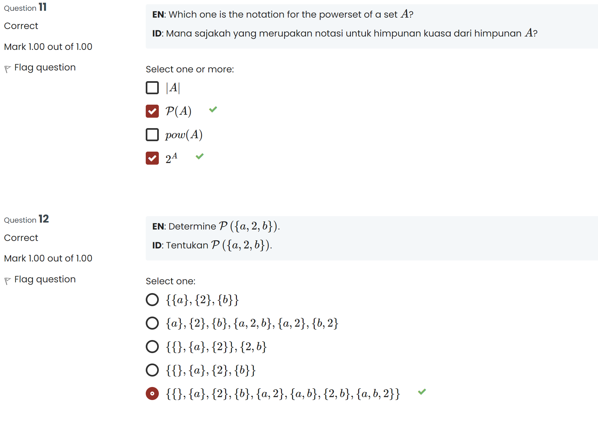
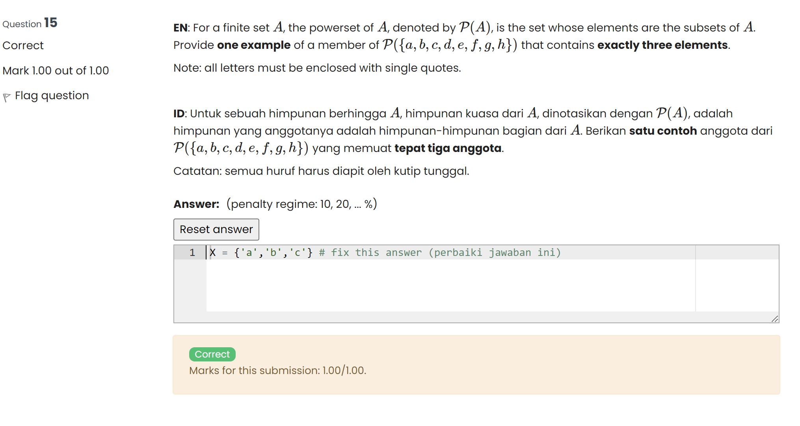

<<<<<<< HEAD
<<<<<<< HEAD

# motion_hack_1

=======

# EcoMerch

> > > > > > > origin/master

Better app adalah aplikasi untuk baca buku, user dapat login dan register lalu juga user dapat melakukan tambah buku, edit buku, baca buku yang telah dimasukkan oleh user.

## Installation

Clone project ini

```bash
https://github.com/Luxferex/MotionHack_04.git
```

Mendapatkan dependency

<<<<<<< HEAD
For help getting started with Flutter development, view the
[online documentation](https://docs.flutter.dev/), which offers tutorials,
samples, guidance on mobile development, and a full API reference.
=======

# MotionHack_04

> > > > > > > # c3af374c65754e463a74617f6422941bbbdd5c44

```bash
flutter pub get
```

Menjalankan project

```bash
flutter run
```

Akun demo

```bash
Email : abdulazisalayubbi@gmail.com
Password : Lolitaa1233
```

## Screenshots

                       

> > > > > > > origin/master
